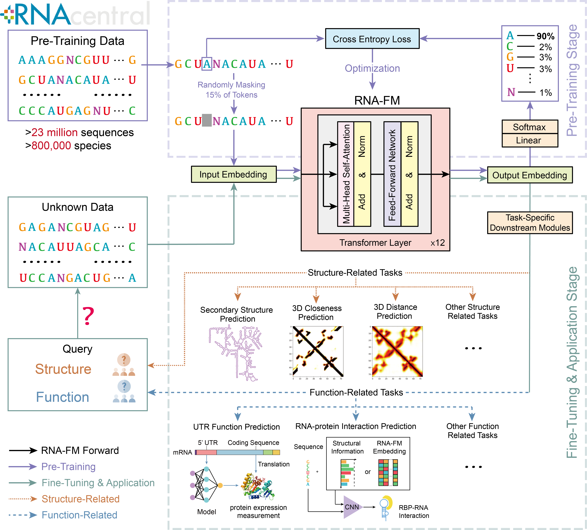

# RNA-FM
This repository contains codes and pre-trained models for **RNA foundation model (RNA-FM)**.
**RNA-FM outperforms all tested single-sequence RNA language models across a variety of structure prediction tasks as well as several function-related tasks.**
You can find more details about **RNA-FM** in our paper, ["Interpretable RNA Foundation Model from Unannotated Data for Highly Accurate RNA Structure and Function Predictions" (Chen et al., 2022).](https://arxiv.org/abs/2204.00300)




<details><summary>Citation</summary>

```bibtex
@article{chen2022interpretable,
  title={Interpretable rna foundation model from unannotated data for highly accurate rna structure and function predictions},
  author={Chen, Jiayang and Hu, Zhihang and Sun, Siqi and Tan, Qingxiong and Wang, Yixuan and Yu, Qinze and Zong, Licheng and Hong, Liang and Xiao, Jin and King, Irwin and others},
  journal={arXiv preprint arXiv:2204.00300},
  year={2022}
}
```
</details>

<details><summary>Table of contents</summary>
  
- [Setup Environment](#Setup_Environment)
- [Pre-trained Models](#Available_Pretrained_Models)
- [Usage](#usage)
  - [RNA-FM Embedding Generation](#RNA-FM_Embedding_Generation)
  - [RNA Secondary Structure Prediction](#RNA_Secondary_Structure_Prediction)
  - [Server](#Server)
  - [Quick Start](#Quick_Start)
- [Citations](#citations)
- [License](#license)
</details>

## Create Environment with Conda <a name="Setup_Environment"></a>
First, download the repository and create the environment.
```
git clone https://github.com/ml4bio/RNA-FM.git
cd ./RNA-FM
conda env create -f environment.yml
```
Then, activate the "RNA-FM" environment and enter into the workspace.
```
conda activate RNA-FM
cd ./redevelop
```
## Access pre-trained models. <a name="Available_Pretrained_Models"></a>
Download pre-trained models from [this gdrive link](https://drive.google.com/drive/folders/1VGye74GnNXbUMKx6QYYectZrY7G2pQ_J?usp=share_link) and place the pth files into the `pretrained` folder.

## Apply RNA-FM with Existing Scripts. <a name="Usage"></a>
### 1. Embedding Extraction. <a name="RNA-FM_Embedding_Generation"></a>
```
python launch/predict.py --config="pretrained/extract_embedding.yml" \
--data_path="./data/examples/example.fasta" --save_dir="./resuts" \
--save_frequency 1 --save_embeddings
```
RNA-FM embeddings with shape of (L,640) will be saved in the `$save_dir/representations`.

### 2. Downstream Prediction - RNA secondary structure. <a name="RNA_Secondary_Structure_Prediction"></a>
```
python launch/predict.py --config="pretrained/ss_prediction.yml" \
--data_path="./data/examples/example.fasta" --save_dir="./resuts" \
--save_frequency 1
```
The predicted probability maps will be saved in form of `.npy` files, and the post-processed binary predictions will be saved in form of `.ct` files. You can find them in the `$save_dir/r-ss`.

### 3. Online Version - RNA-FM server. <a name="Server"></a>
If you have any trouble with the deployment of the local version of RNA-FM, you can access its online version from this link, [RNA-FM server](https://proj.cse.cuhk.edu.hk/rnafm/#/).
You can easily submit jobs on the server and download results from it afterwards, without setting up environment and occupying any computational resources.


## Quick Start for Further Development. <a name="Quick_Start"></a>
PyTorch is the prerequisite package which you must have installed to use this repository.
You can install `rna-fm` in your own environment with the following pip command if you just want to
use the pre-trained language model. 
you can either install rna-fm from PIPY:
```
pip install rna-fm
```
or install `rna-fm` from github:
```
cd ./RNA-FM
pip install .
```
After installation, you can load the RNA-FM and extract its embeddings with the following code:
```
import torch
import fm

# Load RNA-FM model
model, alphabet = fm.pretrained.rna_fm_t12()
batch_converter = alphabet.get_batch_converter()
model.eval()  # disables dropout for deterministic results

# Prepare data
data = [
    ("RNA1", "GGGUGCGAUCAUACCAGCACUAAUGCCCUCCUGGGAAGUCCUCGUGUUGCACCCCU"),
    ("RNA2", "GGGUGUCGCUCAGUUGGUAGAGUGCUUGCCUGGCAUGCAAGAAACCUUGGUUCAAUCCCCAGCACUGCA"),
    ("RNA3", "CGAUUCNCGUUCCC--CCGCCUCCA"),
]
batch_labels, batch_strs, batch_tokens = batch_converter(data)

# Extract embeddings (on CPU)
with torch.no_grad():
    results = model(batch_tokens, repr_layers=[12])
token_embeddings = results["representations"][12]
```
More tutorials can be found from [https://ml4bio.github.io/RNA-FM/](https://ml4bio.github.io/RNA-FM/). The related notebooks are stored in the `tutorials` folder. 

## Citations <a name="citations"></a>

If you find the models useful in your research, we ask that you cite the relevant paper:

For RNA-FM:

```bibtex
@article{chen2022interpretable,
  title={Interpretable rna foundation model from unannotated data for highly accurate rna structure and function predictions},
  author={Chen, Jiayang and Hu, Zhihang and Sun, Siqi and Tan, Qingxiong and Wang, Yixuan and Yu, Qinze and Zong, Licheng and Hong, Liang and Xiao, Jin and King, Irwin and others},
  journal={arXiv preprint arXiv:2204.00300},
  year={2022}
}
```

The model of this code builds on the [esm](https://github.com/facebookresearch/esm) sequence modeling framework. 
And we use [fairseq](https://github.com/pytorch/fairseq) sequence modeling framework to train our RNA language modeling.
We very appreciate these two excellent works!

## License <a name="license"></a>

This source code is licensed under the MIT license found in the `LICENSE` file
in the root directory of this source tree.
